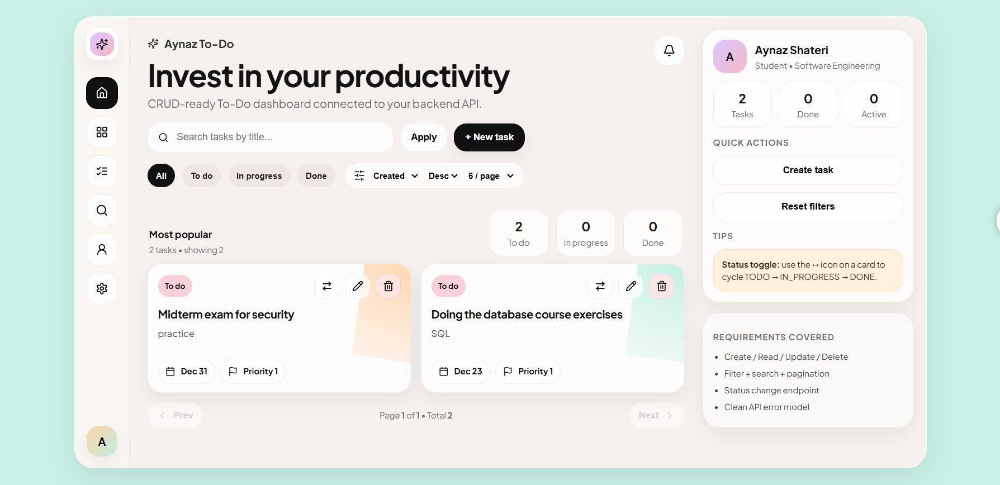

# Aynaz To-Do (Full-Stack)


A full-stack To-Do application with a pastel UI and a production-style backend implementing complete CRUD operations.

**Frontend:** React (Vite)  
**Backend:** FastAPI  
**Databases:** PostgreSQL (SQLAlchemy) / MongoDB (document store)  
**Containerization:** Docker + Docker Compose  
**API Docs:** Swagger (OpenAPI)

---

## Features
- Create / Read / Update / Delete tasks (CRUD)
- Task status workflow: `TODO` → `IN_PROGRESS` → `DONE`
- Filtering and search on task list
- Consistent error responses (validation, not found, server errors)
- CORS configured for local frontend development

---

## Prerequisites
- **Docker Desktop** installed and running
- **Node.js + npm** (only required if you run frontend outside Docker)

---

## Project Structure
```text
.
├── frontend/                 # React (Vite) UI
├── backend-postgres/         # FastAPI + SQLAlchemy (PostgreSQL)
├── backend-mongo/            # FastAPI (MongoDB)
├── docker-compose.postgres.yml
├── docker-compose.mongo.yml
├── README.md
└── docs/
    └── screenshots/          # Optional: UI screenshots for README

Swagger:
http://localhost:8000/docs

Front:
http://localhost:8000/healthz
